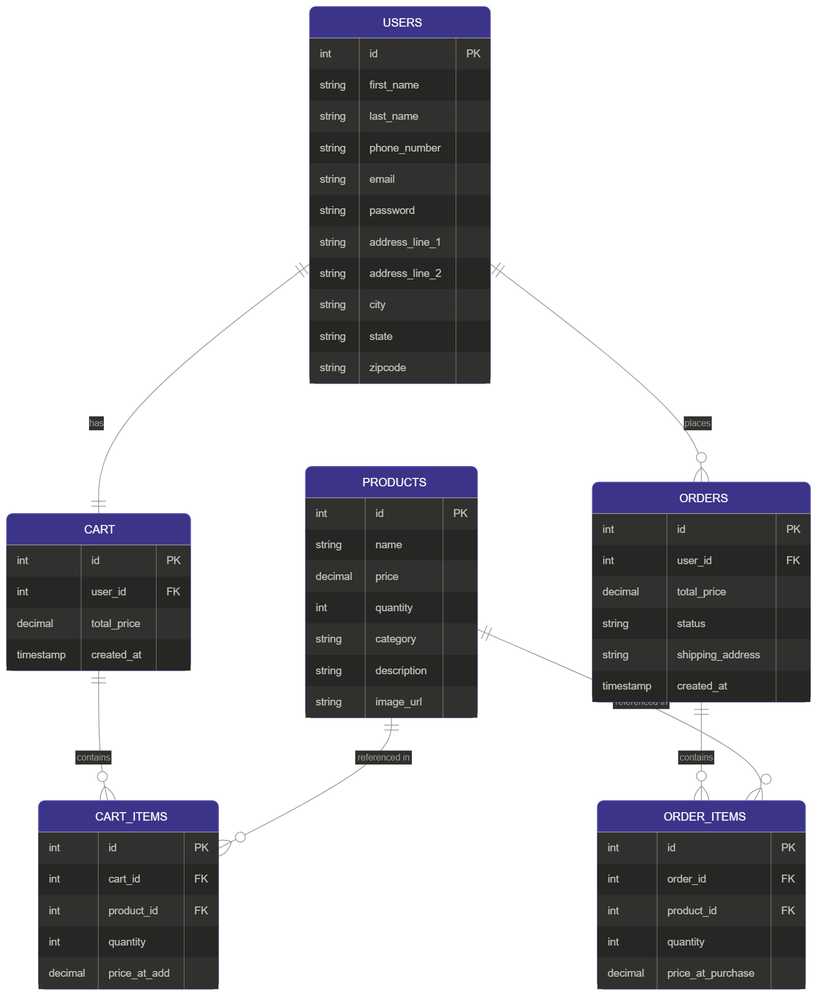

# Entity Relationship Diagram

Reference the Creating an Entity Relationship Diagram final project guide in the course portal for more information about how to complete this deliverable.

## Create the List of Tables

1. Users
2. Products
3. Cart
4. Cart Items
5. Orders
6. Order Items

## Add the Entity Relationship Diagram

